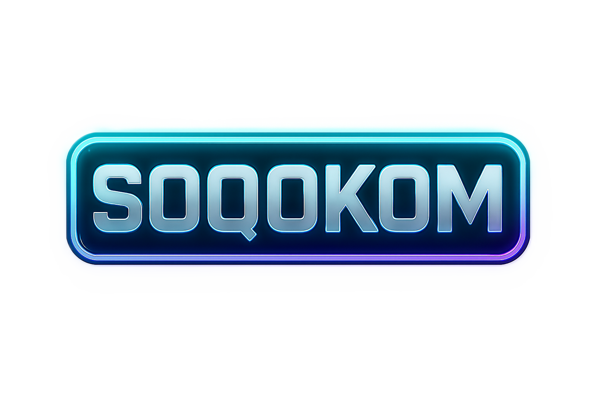

# 🌟 SOQOCOM - Plateforme de Finance Éthique

> Une finance transparente, éthique et accessible pour construire un avenir meilleur, ensemble.



---

## 📖 Table des Matières

- [🎯 Présentation](#-présentation)
- [🚀 Fonctionnalités](#-fonctionnalités)
- [🏗️ Architecture](#️-architecture)
- [💻 Installation](#-installation)
- [🔧 Utilisation](#-utilisation)
- [📊 Tokenomics](#-tokenomics)
- [🛡️ Sécurité](#️-sécurité)
- [🤝 Contribution](#-contribution)
- [📄 Licence](#-licence)

---

## 🎯 Présentation

**SOQOCOM** est une plateforme de finance éthique décentralisée construite sur **Polygon**, combinant transparence blockchain, impact social vérifiable et principes financiers universellement éthiques.

### 🌍 Notre Mission

Démocratiser l'accès à une finance sans intérêts prédateurs, transparente et socialement responsable.

### ✨ Points Clés

```bash
✅ Finance éthique universelle - Accessible à tous
✅ Transparence blockchain - Toutes les transactions vérifiables
✅ Impact social mesurable - 20% des rewards en dons
✅ Gouvernance communautaire - 1 SQCM = 1 vote
✅ Sans cloud - 100% décentralisé
```

---

## 🚀 Fonctionnalités

### 🛒 Mini Marketplace

```bash
🎯 Échange de 9 tokens éthiques
💰 Frais réduits de 30% avec SQCM
📱 Interface mobile-first
⚡ Transactions en 3 clics max
🔍 Scores éthiques visibles
```

### 🏦 Staking Éthique

```bash
🥉 Bronze - 3 mois - 3% APY
🥈 Argent - 6 mois - 5% APY
🥇 Or - 12 mois - 8% APY
🌱 20% des rewards en dons sociaux
```

### 🗳️ Gouvernance DAO

```bash
🗣️ 1 SQCM = 1 vote
📋 Propositions communautaires
⚖️ Décisions transparentes
🔐 Multisig de sécurité
```

### 📊 Tokens Supportés

| Symbole | Nom | Score Éthique |
|---------|-----|---------------|
| **SQCM** | SOQOCOM Token | 95/100 |
| **USDC** | USD Coin | 85/100 |
| **USDT** | Tether | 75/100 |
| **ETH** | Ethereum | 80/100 |
| **MATIC** | Polygon | 82/100 |
| **LINK** | Chainlink | 79/100 |
| **UNI** | Uniswap | 77/100 |
| **SAND** | The Sandbox | 76/100 |
| **MANA** | Decentraland | 74/100 |

---

## 🏗️ Architecture

### 📋 Stack Technique

```bash
# BLOCKCHAIN
🔗 Polygon PoS
📜 Solidity 0.8.19+
🎯 OpenZeppelin Contracts

# FRONTEND
⚡ Next.js 13
🎨 Tailwind CSS
🔐 ethers.js v5
📱 Responsive Design

# BACKEND
💾 Supabase (PostgreSQL)
🔥 Firebase Ready (templates inclus)
📡 Real-time APIs

# DÉPLOIEMENT
🚀 Vercel/Netlify
🌐 DNS décentralisé (optionnel)
📡 IPFS (optionnel)
```

### 🏛️ Smart Contracts

```solidity
// CONTRATS PRINCIPAUX
1. SQCM.sol - Token utility (500M supply)
2. DHSL.sol - Stablecoin adossé argent physique
3. SOQOCOMStaking.sol - Staking avec impact social
4. SOQOCOMGovernance.sol - DAO communautaire
5. SOQOCOMMarketplace.sol - Marketplace décentralisé
6. SOQOCOMOracle.sol - Oracle scores éthiques
```

### 🔗 Architecture Hybride

```bash
# SMART CONTRACTS - Logique métier critique
✅ Staking & Rewards
✅ Gouvernance DAO
✅ Marketplace échanges
✅ Token management

# BASE DE DONNÉES - Données off-chain
✅ Scores éthiques détaillés
✅ Profils utilisateurs
✅ Historique transactions
✅ Métadonnées tokens

# FRONTEND - Interface utilisateur
✅ MetaMask connexion
✅ Dashboard temps réel
✅ Mobile responsive
✅ Web3 optimisé
```

---

## 💻 Installation

### Prérequis

```bash
Node.js >= 18
npm ou yarn
MetaMask (extension navigateur)
Compte Supabase (gratuit)
```

### 🛠️ Installation Locale

```bash
# 1. Cloner le repository
git clone https://github.com/soqocom/soqocom-platform.git
cd soqocom-platform

# 2. Installer les dépendances
npm install

# 3. Configuration environnement
cp .env.example .env.local

# 4. Configurer Supabase
# - Créer un projet sur supabase.com
# - Copier l'URL et la clé dans .env.local
# - Exécuter les migrations SQL (voir /supabase/migrations)

# 5. Lancer en développement
npm run dev

# 6. Ouvrir dans le navigateur
http://localhost:3000
```

### ⚙️ Variables d'Environnement

```env
# .env.local

# Supabase Configuration
NEXT_PUBLIC_SUPABASE_URL=https://votre-projet.supabase.co
NEXT_PUBLIC_SUPABASE_ANON_KEY=votre_cle_anon

# Blockchain Configuration
NEXT_PUBLIC_POLYGON_RPC_URL=https://polygon-rpc.com
NEXT_PUBLIC_CHAIN_ID=137

# Smart Contracts (après déploiement)
NEXT_PUBLIC_SQCM_ADDRESS=0x...
NEXT_PUBLIC_STAKING_ADDRESS=0x...
NEXT_PUBLIC_GOVERNANCE_ADDRESS=0x...
NEXT_PUBLIC_MARKETPLACE_ADDRESS=0x...

# Web3Modal
NEXT_PUBLIC_WEB3MODAL_PROJECT_ID=votre_project_id
```

### 📦 Scripts Disponibles

```bash
npm run dev          # Serveur de développement
npm run build        # Build production optimisé
npm run start        # Lancer le build en production
npm run lint         # Vérifier le code avec ESLint
npm run typecheck    # Vérifier les types TypeScript
```

### 🗄️ Configuration Base de Données

```bash
# 1. Créer un projet Supabase
# Aller sur https://supabase.com et créer un projet

# 2. Exécuter les migrations
# Copier le contenu de /supabase/migrations/*.sql
# et l'exécuter dans l'éditeur SQL Supabase

# 3. Activer Row Level Security
# Les policies sont incluses dans les migrations

# 4. Insérer les données de démo (optionnel)
# Exécuter les scripts dans /supabase/seed.sql
```

---

## 🔧 Utilisation

### 🔐 Première Connexion

```bash
1. 🌐 Aller sur https://soqocom.org
2. 🔗 Cliquer "Se Connecter"
3. 🦊 Choisir MetaMask
4. ✅ Signer la connexion
5. 🎉 Accéder au dashboard
```

### 💱 Effectuer un Swap

```bash
1. 🛒 Aller dans "Marketplace"
2. 🔄 Choisir token source (ex: USDC)
3. 🎯 Choisir token destination (ex: SQCM)
4. 💰 Entrer le montant
5. 👀 Vérifier frais et prix
6. ✅ Confirmer la transaction MetaMask
7. 📊 Voir confirmation blockchain
```

### 🏦 Staker des Tokens

```bash
1. 🏦 Aller dans "Staking"
2. 📊 Choisir la pool (Flexible/Bronze/Silver/Gold)
3. 💰 Entrer le montant à staker
4. ⏳ Vérifier la durée et l'APY
5. ✅ Confirmer la transaction
6. 📈 Suivre les rewards en temps réel
```

### 🗳️ Participer à la Gouvernance

```bash
1. 🗳️ Aller dans "Gouvernance"
2. 📋 Consulter les propositions actives
3. 💭 Étudier les détails et impacts
4. ✅ Voter avec vos SQCM stakés
5. 📊 Suivre les résultats en direct
```

### 📊 Consulter les Scores Éthiques

```bash
1. 🔍 Aller dans "Marketplace"
2. 📊 Cliquer sur un token
3. 📈 Voir les 5 dimensions ESG:
   - Environment (25%)
   - Social (20%)
   - Governance (25%)
   - Transparency (15%)
   - Compliance (15%)
4. 📜 Consulter l'historique des scores
5. 🔗 Voir les sources de données
```

---

## 📊 Tokenomics

### 🎯 Distribution SQCM (500,000,000)

```bash
├── Équipe & Développement: 15% (75M) - Vesting 36 mois
├── Réserve Écosystème: 25% (125M) - Croissance future
├── Liquidité Initiale: 20% (100M) - Stabilité marchés
├── Pré-vente Stratégique: 15% (75M) - Early supporters
├── Programme Communauté: 15% (75M) - Rewards & airdrops
└── Trésorerie DAO: 10% (50M) - Gouvernance éthique
```

### 💎 Utilité du Token SQCM

```solidity
// 5 FONCTIONS PRINCIPALES

1. 🗳️  Gouvernance - 1 SQCM = 1 vote
   └─ Propositions communautaires
   └─ Votes sur allocations budgets
   └─ Décisions stratégiques

2. 💰  Réductions - -30% sur frais marketplace
   └─ 2.5% → 1.75% avec SQCM
   └─ Frais encore plus bas pour holders

3. 🏦  Staking - Rewards + impact social
   └─ APY jusqu'à 15% (Gold)
   └─ 20% des rewards en dons
   └─ Vesting flexible

4. 🔐  Accès - Fonctionnalités premium
   └─ Analytics avancées
   └─ Propositions prioritaires
   └─ Early access nouvelles features

5. 📊  Impact - Vote allocations sociales
   └─ Choix des ONG partenaires
   └─ Suivi transparent des dons
   └─ Rapports d'impact trimestriels
```

### 💰 Prix Cible

```bash
Launch:      €0.02
Q4 2025:     €0.05 - €0.10
Q2 2026:     €0.10 - €0.20
Long terme:  €0.20 - €0.50
```

### 🔄 DHSL Stablecoin

```bash
Nom: Dinar Halal Silver Link
Backing: 1 token = 1 gramme d'argent physique
Audit: Mensuel par tiers de confiance
Rédemption: Possible en argent physique
Stabilité: Corrélé au prix de l'argent
```

---

## 🛡️ Sécurité

### 🔒 Mesures Implémentées

```bash
✅ Contrats audités (2 firmes minimum - prévu Q3 2025)
✅ TimelockController (24-48h délai)
✅ Multisig Gnosis Safe (3/5 signatures)
✅ Pausable d'urgence
✅ ReentrancyGuard sur toutes les fonctions critiques
✅ Tests unitaires complets (coverage > 90%)
✅ Row Level Security (Supabase RLS)
✅ Rate limiting sur APIs
```

### 🚨 Bonnes Pratiques Utilisateurs

```bash
🔐 TOUJOURS vérifier les adresses de contrats
   └─ Officiel: Disponible sur soqocom.org/contracts

👀 TOUJOURS confirmer les détails des transactions
   └─ Montant, destinataire, frais

📱 Utiliser MetaMask officiel uniquement
   └─ https://metamask.io

🌐 Vérifier l'URL du site (HTTPS + cadenas)
   └─ https://soqocom.org

📧 Méfiez-vous des emails de phishing
   └─ Nous ne demandons JAMAIS vos clés privées

🔑 Ne JAMAIS partager votre seed phrase
   └─ Même à "l'équipe SOQOCOM"
```

### 🐛 Signaler une Vulnérabilité

```bash
📧 Email: security@soqocom.org
🔒 PGP Key: Disponible sur demande
💰 Bug Bounty: Programme actif (jusqu'à $50,000)
⏱️ Response time: < 24h pour vulnérabilités critiques
```

### 🔐 Audits de Sécurité

```bash
Q3 2025: Audit #1 par CertiK
Q3 2025: Audit #2 par OpenZeppelin
Q4 2025: Audit économique par Gauntlet
```

---

## 🤝 Contribution

### 🎯 Nous Rejoindre

```bash
# Développeurs
👨‍💻 Frontend React/Next.js
👨‍💻 Smart Contracts Solidity
👨‍💻 Web3 Integration
👨‍💻 Backend & Databases

# Communauté
🌍 Ambassadeurs régionaux
📢 Content creators
🐛 Beta testers
📝 Traducteurs
🎨 Designers
```

### 📋 Processus de Contribution

```bash
1. 🍴 Fork le projet
   └─ https://github.com/soqocom/soqocom-platform

2. 🌿 Créer une branche feature
   └─ git checkout -b feature/AmazingFeature

3. 💾 Commiter les changements
   └─ git commit -m 'Add AmazingFeature'

4. 📤 Push vers la branche
   └─ git push origin feature/AmazingFeature

5. 🔀 Créer une Pull Request
   └─ Description détaillée + screenshots si UI
```

### 🏷️ Guidelines de Code

```bash
📝 Code clair et commenté (français ou anglais)
✅ Tests pour nouvelles fonctionnalités
📖 Documentation à jour dans README
🎨 Respect des standards ESLint/Prettier
🔒 Pas de clés ou secrets dans le code
🐛 Pas de console.log() dans le code final
```

### 💡 Idées de Contributions

```bash
🌟 High Impact
├─ Nouveaux tokens éthiques à lister
├─ Amélioration calculs scores ESG
├─ Optimisations gas smart contracts
└─ Traductions interface

🎨 UI/UX
├─ Dark mode complet
├─ Animations micro-interactions
├─ Accessibilité (WCAG 2.1)
└─ Mobile app (React Native)

📊 Data & Analytics
├─ Dashboard analytics avancées
├─ Graphiques historiques
├─ Export de données
└─ Notifications push

🔧 Technique
├─ Tests E2E avec Cypress
├─ Performance optimizations
├─ PWA support
└─ Offline mode
```

---

## 📄 Licence

Ce projet est sous licence **MIT**.

```text
MIT License

Copyright (c) 2025 SOQOCOM

Permission est accordée, gratuitement, à toute personne obtenant une copie
de ce logiciel et des fichiers de documentation associés (le "Logiciel"),
de traiter le Logiciel sans restriction, y compris, sans s'y limiter,
les droits d'utilisation, de copie, de modification, de fusion, de publication,
de distribution, de sous-licence et/ou de vente de copies du Logiciel...

LE LOGICIEL EST FOURNI "TEL QUEL", SANS GARANTIE D'AUCUNE SORTE.
```

---

## 🌐 Liens Utiles

### 📱 Réseaux Sociaux

- 🌐 **Site Web**: [https://soqocom.org](https://soqocom.org)
- 📖 **Documentation**: [https://docs.soqocom.org](https://docs.soqocom.org)
- 🐦 **Twitter**: [@SOQOCOM_Official](https://twitter.com/SOQOCOM_Official)
- 💬 **Discord**: [discord.gg/soqocom](https://discord.gg/soqocom)
- 📰 **Blog**: [https://blog.soqocom.org](https://blog.soqocom.org)
- 📺 **YouTube**: [SOQOCOM Channel](https://youtube.com/soqocom)
- 💼 **LinkedIn**: [SOQOCOM](https://linkedin.com/company/soqocom)

### 🔗 Ressources Techniques

- 📜 **Smart Contracts**: [PolygonScan](https://polygonscan.com/address/0x...)
- 📊 **Analytics**: [Dune Dashboard](https://dune.com/soqocom)
- 🔐 **Multisig**: [Gnosis Safe](https://app.safe.global/...)
- 📈 **Token Stats**: [CoinGecko](https://coingecko.com/en/coins/soqocom)

### 📞 Contact

- 📧 **Support**: support@soqocom.org
- 💼 **Partenariats**: partnerships@soqocom.org
- 🔒 **Sécurité**: security@soqocom.org
- 📰 **Presse**: press@soqocom.org

---

## 🚀 Roadmap

### Phase 1 - Lancement (Q4 2025) ✅

```bash
✅ Marketplace éthique opérationnel
✅ Staking SQCM avec impact social
✅ Gouvernance DAO active
✅ 9 tokens éthiques listés
✅ Scoring ESG automatisé
✅ Interface responsive
```

### Phase 2 - Croissance (Q1-Q2 2026) 🔄

```bash
🔄 Application mobile iOS/Android
🔄 DHSL Stablecoin argent déployé
🔄 Bridge Haqq Network intégré
🔄 20+ tokens éthiques listés
🔄 Produits financiers avancés
🔄 Partenariats ONG majeurs
```

### Phase 3 - Expansion (Q3-Q4 2026) 🔜

```bash
🔜 Migration zkEVM Polygon
🔜 Lending/Borrowing éthique
🔜 Assurance décentralisée
🔜 NFT à impact social
🔜 Fiat on/off ramp
🔜 Cartes de paiement crypto
```

### Phase 4 - Vision (2027+) 🌟

```bash
🌟 SOQOCOM Chain L1 propre
🌟 Ecosystem Fund ($50M)
🌟 Partenariats institutionnels
🌟 Expansion globale (50+ pays)
🌟 100M+ utilisateurs
🌟 $1B+ impact social mesuré
```

---

## 📈 KPIs & Metrics

### 🎯 Objectifs 2025

```bash
👥 Utilisateurs: 100,000+
💰 Volume échangé: $50M+
🏦 Total Value Locked: $20M+
🌱 Dons générés: $500K+
🗳️ Propositions DAO: 50+
⭐ Tokens listés: 20+
```

### 📊 Suivi en Temps Réel

Consultez notre [Dashboard Analytics](https://analytics.soqocom.org) pour les metrics à jour.

---

## 🙏 Remerciements

### 💚 Équipe Fondatrice

**Développé avec passion par l'équipe SOQOCOM**

### 🤝 Partenaires

- Polygon Network
- Chainlink Oracles
- OpenZeppelin
- Supabase
- Et tous nos early supporters !

### 🌟 Communauté

Merci à tous les contributeurs, testeurs, ambassadeurs et membres de la communauté qui rendent SOQOCOM possible !

---

## ✨ Rejoignez la révolution de la finance éthique !

> "Une finance transparente, éthique et accessible pour construire un avenir meilleur, ensemble."

### 🚀 Commencez dès maintenant

```bash
# Installation en 3 commandes
git clone https://github.com/soqocom/soqocom-platform.git
cd soqocom-platform
npm install && npm run dev
```

### 💬 Besoin d'aide ?

- 📖 Consultez la [Documentation](https://docs.soqocom.org)
- 💬 Rejoignez notre [Discord](https://discord.gg/soqocom)
- 📧 Écrivez-nous: support@soqocom.org

---

<div align="center">

**Made with 💚 by the SOQOCOM Team**

*Finance Éthique 3.0 - Transparent. Sécurisé. Responsable.*

[Website](https://soqocom.org) • [Documentation](https://docs.soqocom.org) • [Twitter](https://twitter.com/SOQOCOM_Official) • [Discord](https://discord.gg/soqocom)

</div>
